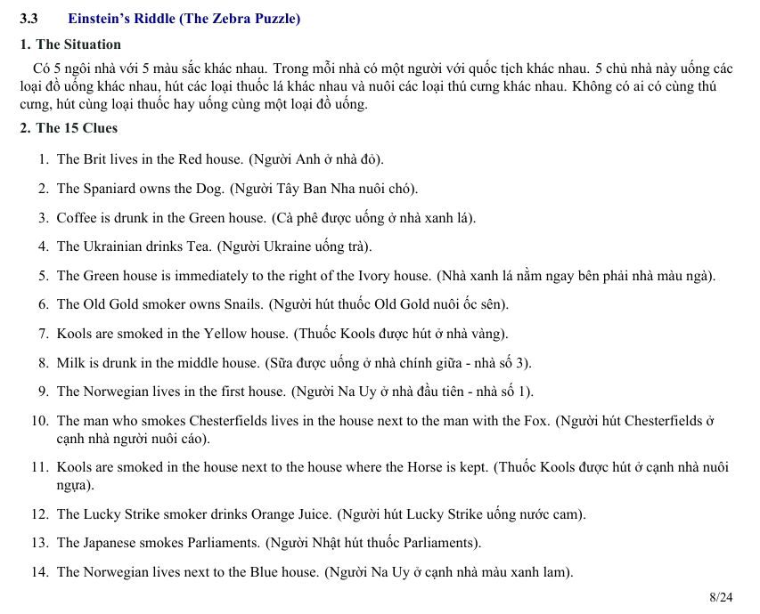
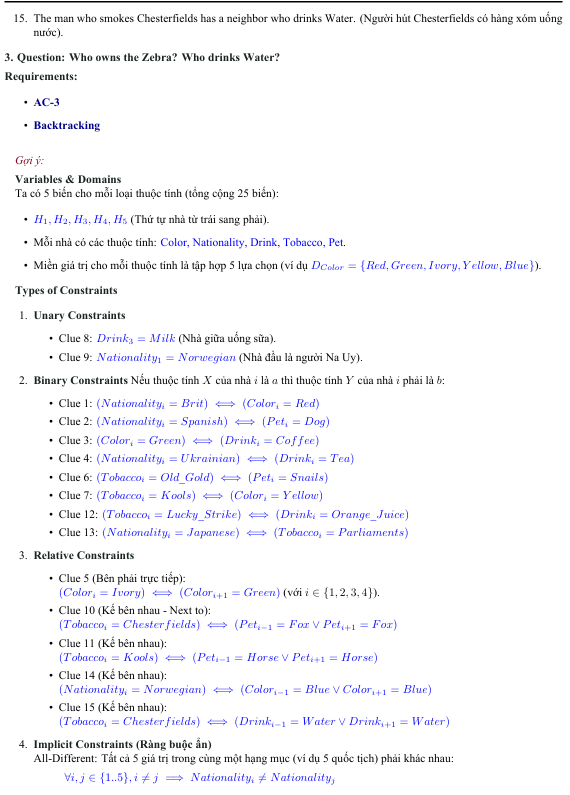

# Problem

## Variables

Ta có 5 biến cho mỗi thuộc tính (tổng cộng 25 biến):

- $H_1, H_2, H_3, H_4, H_5$ (Thứ tự nhà từ trái sang phải).
- Mỗi nhà có các thuộc tính: $Color, Nationality, Drink, Tobacco, Pet.$

## Miền giá trị cho mỗi thuộc tính (Domains)

### Color
mỗi nhà:
$$D_{Color} = \{Red, Green, Ivory, Yellow, Blue\}$$

### Nationality
$$D_{Nationality} = \{Brit, Spanish, Ukrainian, Norwegian, Japanese\}$$

### Drink
$$D_{Drink} = \{Coffee, Tea, Milk, OrangeJuice, Water \}$$

### Tobacco
$$D_{Tobacco} = \{OldGold, Kools, Chesterfields, LuckyStrike, Parliaments \}$$

### Pet
$$D_{Pet} = \{Dog, Snails, Fox, Horse, Zebra \}$$

Sau khi thử tất cả các cách thì File Trí Tuệ nhân tạo nhóm 2.pdf là file làm bài hoàn chỉnh. 
- Cách giải tay AC-3 thuần tùy là quá lâu, chỉ áp dụng kiến thử để loại tay chứ ko phải tuân theo model và cuối cùng là dùng backtrack để chọn kết quả và loại dần.