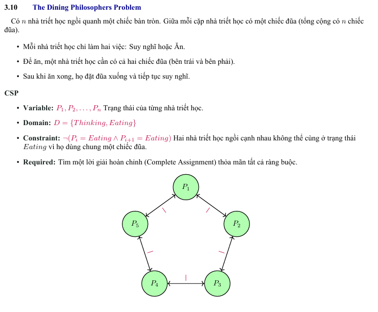

# Problem

Với n nhà triết học ngồi quanh chiếc bàn tròn và $n \ge 2$

Ta có  hai trường hợp là n chẵn và n lẻ.

## Trường hợp 1: n chẳn

Đặt:
- $P_i = Eating$ nếu i là số chẵn
- $P_i = Thinking$ nếu i là số lẻ.

với mọi i, hai người cạnh nhau là $P_i$ và $P_{i+1}$, vì n chẵn, tính chẵn lẻ của i và i + 1 luôn khác nhau. Do đó một người $Eating$ và người kia là $Thinking$. Không có cặp nào cùng $Eating$. vậy phép gán thỏa mãn.

## Trường hợp 2: n lẻ
Đặt:
- $P_i = Eating$ với i = 2, 4, 6, ..., n-1 (các số chẵn từ 2 đến n - 1).
- $P_i = Thinking$ với tất cả các i còn lại (i = 1, 3, 5, ..., n).

Kiểm tra:
-  Các cặp (i, i+1) với i = 1, 2, ..., n-1:
    - Nếu i lẻ: $P_i = Thinking, P_{i+1}$ lẻ $\Rightarrow Eating.$
    - Nếu i chẳn và i $\le n - 1: P_i = Eating, P_{i+1}$ lẻ $\Rightarrow Thinking.$
- Cặp cuối $(P_n, P_1)$: n lẻ $\Rightarrow P_n = Thinking, P_1 = Thinking$.

Vậy không có cặp nào gồm 2 $Eating$ cạnh nhau. Phép gán thỏa mãn.