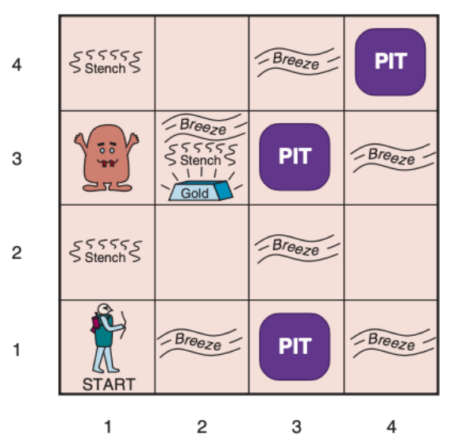

# Wumpus World ở map 0

- Giả sử Agent đang ở vị trí (3, 2).
    - cột 3 hàng 2.

Agent quyết định đi tiếp như thế nào để đảm bảo không chết và đi đến chiến thắng, chứng minh.

Vì ban đầu Agent phải xuất phát từ vị trí (1, 1) và để đi đến được vị trí (3, 2) thì Agent phải có quá trình tiếp thu các Knowledge Base.

KB:

- Tại ô (1, 1) Agent cảm nhận được không có _Breeze_ và không có _Stench_

    - $R_1: \neg P_{1, 1}$
    - $R_2: \neg W_{1, 1}$

    Định nghĩa Breeze:
    - $R_3: B_{1, 1} \Leftrightarrow (P_{1, 2} \vee P_{2, 1})$

    Định nghĩa Stench
    - $R_4: S_{1, 1} \Leftrightarrow (W_{1, 2} \vee W_{2, 1})$

    - $R_5: \neg B_{1, 1}$
    - $R_6: \neg S_{1, 1}$

    áp dụng luật logic __Biconditional Elimination__ đối với $R_3$
    - $R_7:\big((P_{1,2}\vee P_{2,1})\Rightarrow B_{1,1}\big)\wedge\big(B_{1,1}\Rightarrow(P_{1,2}\vee P_{2,1})\big)$

    Áp dụng luật __And-Elimination__ đối với $R_7$:

    - $R_8:(P_{1,2}\vee P_{2,1})\Rightarrow B_{1,1}$

    Áp dụng luật __Contrapositive__ đối với $R_8$:

    - $R_9:\neg B_{1,1}\Rightarrow\neg(P_{1,2}\vee P_{2,1})$

    Áp dụng luật __Modus Ponens__ giữa $R_9$ và $R_5$:

    - $R_{10}:\neg(P_{1,2}\vee P_{2,1})$

    Áp dụng luật __De Morgan__ đối với $R_{10}$:

    - $R_{11}:\neg P_{1,2}\wedge \neg P_{2,1}$

    Áp dụng luật __Biconditional Elimination__ đối với $R_4$:

    - $R_{12}:\big((W_{1,2}\vee W_{2,1})\Rightarrow S_{1,1}\big)\wedge\big(S_{1,1}\Rightarrow(W_{1,2}\vee W_{2,1})\big)$

    Áp dụng luật __And-Elimination__ đối với $R_{12}$:

    - $R_{13}:(W_{1,2}\vee W_{2,1})\Rightarrow S_{1,1}$

    Áp dụng luật __Contrapositive__ đối với $R_{13}$:

    - $R_{14}:\neg S_{1,1}\Rightarrow\neg(W_{1,2}\vee W_{2,1})$

    Áp dụng luật __Modus Ponens__ giữa $R_{14}$ và $R_6$:

    - $R_{15}:\neg(W_{1,2}\vee W_{2,1})$

    Áp dụng luật __De Morgan__ đối với $R_{15}$:

    - $R_{16}:\neg W_{1,2}\wedge \neg W_{2,1}$

Từ $R_{11}$ và $R_{16}$:
$$Safe(1, 2) \equiv \neg P_{1, 2} \wedge \neg W_{1, 2}$$
$$Safe(2, 1) \equiv \neg P_{2, 1} \wedge \neg W_{2, 1}$$

Lúc này Agent Có thể đi đến 1 trong 2 ô (1, 2) hoặc (2, 1) Giả sử Agent quyết định đi đến ô (2, 1) ta có:

- Tại ô (2, 1) Agent cảm nhận được có _Breeze_ và không có _Stench_.

    Định nghĩa Breeze:

    - $R_{17}:B_{2,1}\Leftrightarrow(P_{1,1}\vee P_{2,2}\vee P_{3,1})$

    Định nghĩa Stench:

    - $R_{18}:S_{2,1}\Leftrightarrow(W_{1,1}\vee W_{2,2}\vee W_{3,1})$

    - $R_{19}:B_{2,1}$
    - $R_{20}:\neg S_{2,1}$

    Áp dụng luật __Biconditional Elimination__ đối với $R_{17}$:

    - $R_{21}:\big(B_{2,1}\Rightarrow(P_{1,1}\vee P_{2,2}\vee P_{3,1})\big)\wedge\big((P_{1,1}\vee P_{2,2}\vee P_{3,1})\Rightarrow B_{2,1}\big)$

    Áp dụng luật __And-Elimination__ đối với $R_{21}$:

    - $R_{22}:B_{2,1}\Rightarrow(P_{1,1}\vee P_{2,2}\vee P_{3,1})$

    Áp dụng luật __Modus Ponens__ giữa $R_{22}$ và $R_{19}$:

    - $R_{23}:P_{1,1}\vee P_{2,2}\vee P_{3,1}$

    Áp dụng luật __Resolution__ giữa $R_{23}$ và $R_{1}$:

    - $R_{24}:P_{2,2}\vee P_{3,1}$

    Áp dụng luật __Biconditional Elimination__ đối với $R_{18}$:

    - $R_{25}:\big(S_{2,1}\Rightarrow(W_{1,1}\vee W_{2,2}\vee W_{3,1})\big)\wedge\big((W_{1,1}\vee W_{2,2}\vee W_{3,1})\Rightarrow S_{2,1}\big)$

    Áp dụng luật __And-Elimination__ đối với $R_{25}$:

    - $R_{26}:(W_{1,1}\vee W_{2,2}\vee W_{3,1})\Rightarrow S_{2,1}$

    Áp dụng luật __Contrapositive__ đối với $R_{26}$:

    - $R_{27}:\neg S_{2,1}\Rightarrow\neg(W_{1,1}\vee W_{2,2}\vee W_{3,1})$

    Áp dụng luật __Modus Ponens__ giữa $R_{27}$ và $R_{20}$:

    - $R_{28}:\neg(W_{1,1}\vee W_{2,2}\vee W_{3,1})$

    Áp dụng luật __De Morgan__ đối với $R_{28}$:

    - $R_{29}:\neg W_{1,1}\wedge\neg W_{2,2}\wedge\neg W_{3,1}$

    Áp dụng luật __And-Elimination__ đối với $R_{29}$:

    - $R_{30}:\neg W_{2,2}$
    - $R_{31}:\neg W_{3,1}$

Từ $R_{24}$ và $R_{29}$:
- ô (2, 2) và (3, 1) đều không chứa Wumpus
- tuy nhiên ít nhất 1 trong 2 ô chứa Pit

Do đó Agent không thể chứng minh được ô nào an toàn.

Vì trước đó đã biết ô (1, 2) là an toàn và chưa kiểm tra. Nên Agent quay lui về ô (1, 1) và tiếp tục khám phá ô (1, 2).

- Tại ô (1, 2), Agent cảm nhận được có _Stench_ và không có _Breeze_.

    Định nghĩa Breeze:
    - $R_{32}: B_{1, 2} \Leftrightarrow (P_{1, 1} \vee P_{2, 2} \vee P_{1, 3})$

    Định nghĩa Stench:
    - $R_{33}: S_{1, 2} \Leftrightarrow (W_{1, 1} \vee W_{2, 2} \vee W_{1, 3})$

    - $R_{34}: \neg B_{1, 2}$
    - $R_{35}: S_{1, 2}$

    Áp dụng luật __Biconditional Elimination__ đối với $R_{32}$:

    - $R_{36}:\big(B_{1,2}\Rightarrow(P_{1,1}\vee P_{2,2}\vee P_{1,3})\big)\wedge\big((P_{1,1}\vee P_{2,2}\vee P_{1,3})\Rightarrow B_{1,2}\big)$

    Áp dụng luật __And-Elimination__ đối với $R_{36}$:

    - $R_{37}:(P_{1,1}\vee P_{2,2}\vee P_{1,3})\Rightarrow B_{1,2}$

    Áp dụng luật __Contrapositive__ đối với $R_{37}$:

    - $R_{38}:\neg B_{1,2}\Rightarrow\neg(P_{1,1}\vee P_{2,2}\vee P_{1,3})$

    Áp dụng luật __Modus Ponens__ giữa $R_{38}$ với $R_{34}$:

    - $R_{39}:\neg(P_{1,1}\vee P_{2,2}\vee P_{1,3})$

    Áp dụng luật __De Morgan__ đối với $R_{39}$:

    - $R_{40}:\neg P_{1,1}\wedge\neg P_{2,2}\wedge\neg P_{1,3}$

    Áp dụng luật __Biconditional Elimination__ đối với $R_{33}$:

    - $R_{41}:\big(S_{1,2}\Rightarrow(W_{1,1}\vee W_{2,2}\vee W_{1,3})\big)\wedge\big((W_{1,1}\vee W_{2,2}\vee W_{1,3})\Rightarrow S_{1,2}\big)$

    Áp dụng luật __And-Elimination__ đối với $R_{41}$:

    - $R_{42}:S_{1,2}\Rightarrow(W_{1,1}\vee W_{2,2}\vee W_{1,3})$

    Áp dụng luật __Modus Ponens__ giữa $R_{42}$ với $R_{35}$:

    - $R_{43}:W_{1,1}\vee W_{2,2}\vee W_{1,3}$

    Áp dụng luật __Resolution__ giữa $R_{43}$ và $R_2$:

    - $R_{44}:W_{2,2}\vee W_{1,3}$

    Từ $R_{29}: \neg W_{1, 1} \wedge \neg W_{2, 2} \wedge \neg W_{3, 1}$

    Áp dụng luật __And-Elimination__ đối với $R_{29}$:

    - $R_{45}:\neg W_{2,2}$

    Áp dụng luật __Resolution__ giữa $R_{44}$ và $R_{45}$:

    - $R_{46}:W_{1,3}$

    Áp dụng luật __And-Elimination__ đối với $R_{40}$:

    - $R_{47}:\neg P_{2,2}$

Từ $R_{45}$ và $R_{47}$:
$$Safe(2, 2) \equiv \neg P_{2, 2} \wedge \neg W_{2, 2}$$

Do đó Agent kết luận rằng ô (2, 2) là an toàn và quyết định di chuyển đến ô (2, 2)

- Tại ô (2, 2), Agent cảm nhận được Không có _Breeze_ và không có _Stench_.

    Định nghĩa Breeze:

    - $R_{48}: B_{2,2}\Leftrightarrow(P_{1,2}\vee P_{2,1}\vee P_{2,3}\vee P_{3,2})$

    Định nghĩa Stench:

    - $R_{49}: S_{2,2}\Leftrightarrow(W_{1,2}\vee W_{2,1}\vee W_{2,3}\vee W_{3,2})$

    - $R_{50}: \neg B_{2,2}$
    - $R_{51}: \neg S_{2,2}$

    Áp dụng luật __Biconditional Elimination__ đối với $R_{48}$:

    - $R_{52}: B_{2,2}\Rightarrow(P_{1,2}\vee P_{2,1}\vee P_{2,3}\vee P_{3,2})$
    - $R_{53}: (P_{1,2}\vee P_{2,1}\vee P_{2,3}\vee P_{3,2})\Rightarrow B_{2,2}$

    Áp dụng luật __Contrapositive__ đối với $R_{53}$:

    - $R_{54}: \neg B_{2,2}\Rightarrow\neg(P_{1,2}\vee P_{2,1}\vee P_{2,3}\vee P_{3,2})$

    Áp dụng luật __Modus Ponens__ giữa $R_{54}$ với $R_{50}$:

    - $R_{55}: \neg(P_{1,2}\vee P_{2,1}\vee P_{2,3}\vee P_{3,2})$

    Áp dụng luật __De Morgan__ đối với $R_{55}$:

    - $R_{56}: \neg P_{1,2}\wedge\neg P_{2,1}\wedge\neg P_{2,3}\wedge\neg P_{3,2}$

    Áp dụng luật __And-Elimination__ đối với $R_{56}$:

    - $R_{57}: \neg P_{2,3}$
    - $R_{58}: \neg P_{3,2}$

    Áp dụng luật __Biconditional Elimination__ đối với $R_{49}$:

    - $R_{59}: S_{2,2}\Rightarrow(W_{1,2}\vee W_{2,1}\vee W_{2,3}\vee W_{3,2})$
    - $R_{60}: (W_{1,2}\vee W_{2,1}\vee W_{2,3}\vee W_{3,2})\Rightarrow S_{2,2}$

    Áp dụng luật __Contrapositive__ đối với $R_{60}$:

    - $R_{61}: \neg S_{2,2}\Rightarrow\neg(W_{1,2}\vee W_{2,1}\vee W_{2,3}\vee W_{3,2})$

    Áp dụng luật __Modus Ponens__ giữa $R_{61}$ với $R_{51}$:

    - $R_{62}: \neg(W_{1,2}\vee W_{2,1}\vee W_{2,3}\vee W_{3,2})$

    Áp dụng luật __De Morgan__ đối với $R_{62}$:

    - $R_{63}: \neg W_{1,2}\wedge\neg W_{2,1}\wedge\neg W_{2,3}\wedge\neg W_{3,2}$

    Áp dụng luật __And-Elimination__ đối với $R_{63}$:

    - $R_{64}: \neg W_{2,3}$
    - $R_{65}: \neg W_{3,2}$

Từ $R_{57}$ và $R_{64}$:
$$
Safe(2,3)\equiv\neg P_{2,3}\wedge\neg W_{2,3}
$$

Từ $R_{58}$ và $R_{65}$:
$$
Safe(3,2)\equiv\neg P_{3,2}\wedge\neg W_{3,2}
$$

Vì ô (3, 2) là an toàn, điều này phù hợp với giả thiết của đề bài rằng Agent hiện đang ở ô (3, 2). Từ đây Agent tiếp tục suy luận để quyết định bước đi tiếp theo.

- Tại ô (3, 2), Agent cảm nhận được có _Breeze_ và không có _Stench_.

    Định nghĩa Breeze:

    - $R_{66}: B_{3,2}\Leftrightarrow(P_{2,2}\vee P_{3,1}\vee P_{3,3}\vee P_{4,2})$

    Định nghĩa Stench:

    - $R_{67}: S_{3,2}\Leftrightarrow(W_{2,2}\vee W_{3,1}\vee W_{3,3}\vee W_{4,2})$

    - $R_{68}: B_{3,2}$

    - $R_{69}: \neg S_{3,2}$

    Áp dụng luật __Biconditional Elimination__ đối với $R_{66}$

    - $R_{70}: (B_{3,2}\Rightarrow(P_{2,2}\vee P_{3,1}\vee P_{3,3}\vee P_{4,2}))
    \wedge
    ((P_{2,2}\vee P_{3,1}\vee P_{3,3}\vee P_{4,2})\Rightarrow B_{3,2})$

    Áp dụng luật __And-Elimination__ đối với $R_{70}$

    - $R_{71}: B_{3,2}\Rightarrow(P_{2,2}\vee P_{3,1}\vee P_{3,3}\vee P_{4,2})$

    Áp dụng luật __Modus Ponens__ giữa $R_{71}$ và $R_{68}$

    - $R_{72}: P_{2,2}\vee P_{3,1}\vee P_{3,3}\vee P_{4,2}$

    Áp dụng __Resolution__ giữa $R_{72}$ và $R_{47}$

    - $R_{73}: P_{3,1}\vee P_{3,3}\vee P_{4,2}$

    Áp dụng luật __Biconditional Elimination__ đối với $R_{67}$

    - $R_{74}: (S_{3,2}\Rightarrow(W_{2,2}\vee W_{3,1}\vee W_{3,3}\vee W_{4,2}))
    \wedge
    ((W_{2,2}\vee W_{3,1}\vee W_{3,3}\vee W_{4,2})\Rightarrow S_{3,2})$

    Áp dụng luật __And-Elimination__ đối với $R_{74}$

    - $R_{75}: (W_{2,2}\vee W_{3,1}\vee W_{3,3}\vee W_{4,2})
    \Rightarrow S_{3,2}$

    Áp dụng luật __Contrapositive__ đối với $R_{75}$

    - $R_{76}: \neg S_{3,2}
    \Rightarrow
    \neg(W_{2,2}\vee W_{3,1}\vee W_{3,3}\vee W_{4,2})$

    Áp dụng luật __Modus Ponens__ giữa $R_{76}$ và $R_{69}$

    - $R_{77}: \neg(W_{2,2}\vee W_{3,1}\vee W_{3,3}\vee W_{4,2})$

    Áp dụng luật __De Morgan__ đối với $R_{77}$

    - $R_{78}: \neg W_{2,2}
    \wedge
    \neg W_{3,1}
    \wedge
    \neg W_{3,3}
    \wedge
    \neg W_{4,2}$

    Áp dụng luật __And-Elimination__ đối với $R_{78}$

    - $R_{79}: \neg W_{3,1}$
    - $R_{80}: \neg W_{3,3}$
    - $R_{81}: \neg W_{4,2}$

Từ $R_{73}$ và $R_{79}, R_{80}, R_{81}$:

- Các ô $(3,1)$, $(3,3)$ và $(4,2)$ đều không chứa Wumpus.
- Tuy nhiên:

$$
P_{3,1}\vee P_{3,3}\vee P_{4,2}
$$

nên ít nhất một trong ba ô trên chứa Pit.

Do đó Agent không thể chứng minh được ô mới nào là an toàn.

Mặt khác, từ $R_{57}$ và $R_{64}$ ta đã có:

$$
Safe(2,3)\equiv\neg P_{2,3}\wedge\neg W_{2,3}
$$

Vì vậy Agent quay lui về ô $(2,3)$.

- Tại ô $(2,3)$ Agent cảm nhận được có _Glitter_, có _Breeze_ và có _Stench_.

    - $R_{82}: G_{2,3}$

Từ $R_{82}$, Agent thực hiện hành động:

$$
Grab
$$

để lấy Gold.

Sau đó Agent quay trở lại ô xuất phát $(1,1)$ và thực hiện:

$$
Climb
$$

Do đó Agent chiến thắng mà vẫn bảo đảm không đi vào bất kỳ ô nào chứa Pit hoặc Wumpus.

